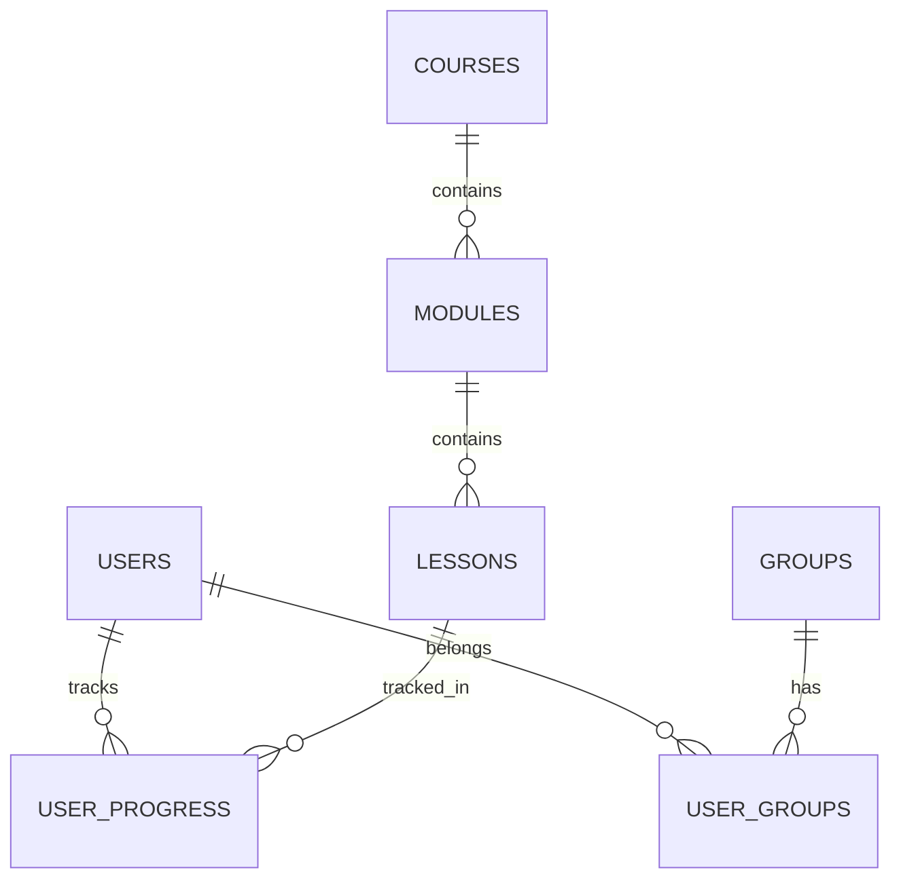

# VPJ EAD Platform

## Visão Geral

A VPJ EAD Platform é uma plataforma de ensino à distância desenvolvida especificamente para a VPJ Alimentos, focada em cursos de pecuária, gestão de pastagens e nutrição animal. A plataforma oferece uma experiência de aprendizado completa e interativa, com recursos modernos e interface inspirada na Netflix.

## Tecnologias Utilizadas

- **Frontend:**
  - React 18
  - TypeScript
  - Tailwind CSS
  - Vite
  - React Router DOM
  - Tanstack Query
  - Zustand
  - Framer Motion
  - Lucide Icons

- **Backend:**
  - Supabase (PostgreSQL + Auth + Storage)

## Arquitetura

### Frontend

A aplicação frontend é estruturada em módulos:

```
src/
├── components/     # Componentes reutilizáveis
├── hooks/         # Custom hooks
├── lib/           # Configurações e utilitários
├── pages/         # Páginas da aplicação
├── providers/     # Providers React
├── services/      # Serviços de API
├── store/         # Gerenciamento de estado global
└── types/         # Definições de tipos TypeScript
```

### Backend (Supabase)

O backend utiliza o Supabase com as seguintes funcionalidades:

- **Authentication:** Autenticação de usuários
- **Database:** PostgreSQL para armazenamento de dados
- **Storage:** Armazenamento de arquivos (vídeos, imagens e documentos)
- **Row Level Security (RLS):** Políticas de segurança por linha

## Funcionalidades Principais

### 1. Autenticação e Autorização

- Login/Logout
- Controle de acesso baseado em roles (admin/student)
- Gerenciamento de grupos e permissões

### 2. Gestão de Cursos

- Criação e edição de cursos
- Organização em módulos e aulas
- Upload de vídeos e materiais complementares
- Sistema de progresso e conclusão

### 3. Área do Aluno

- Dashboard personalizado
- Progresso dos cursos
- Certificados
- Histórico de atividades

### 4. Área Administrativa

- Gestão de usuários
- Gerenciamento de conteúdo
- Relatórios e métricas
- Configurações do sistema

### 5. Biblioteca Digital

- E-books
- Materiais complementares
- Sistema de download e controle de acesso

### 6. Sistema de Notícias

- Publicação de notícias e atualizações
- Categorização e tags
- Destaque de conteúdo

## Modelos de Dados

### Principais Entidades

1. **Users**
   - Informações do usuário
   - Dados de perfil
   - Métricas de progresso

2. **Courses**
   - Informações do curso
   - Estrutura de módulos
   - Requisitos e configurações

3. **Modules**
   - Organização do conteúdo
   - Sequência de aulas
   - Avaliações

4. **Lessons**
   - Conteúdo das aulas
   - Vídeos e materiais
   - Controle de progresso

5. **Groups**
   - Agrupamento de usuários
   - Permissões de acesso
   - Configurações específicas

## Configuração do Ambiente

### Requisitos

- Node.js 18+
- npm ou yarn
- Conta no Supabase

### Instalação

1. Clone o repositório
```bash
git clone [url-do-repositorio]
cd vpj-ead-platform
```

2. Instale as dependências
```bash
npm install
```

3. Configure as variáveis de ambiente
```env
VITE_SUPABASE_URL=sua-url-do-supabase
VITE_SUPABASE_ANON_KEY=sua-chave-anon-do-supabase
```

4. Execute o projeto
```bash
npm run dev
```

## Estrutura do Banco de Dados

### Tabelas Principais

1. **users**
   - Armazena informações dos usuários
   - Relacionamento com grupos e permissões

2. **courses**
   - Catálogo de cursos
   - Metadados e configurações

3. **modules**
   - Organização do conteúdo dos cursos
   - Sequenciamento e requisitos

4. **lessons**
   - Conteúdo das aulas
   - Recursos e materiais

5. **user_progress**
   - Acompanhamento do progresso
   - Histórico de atividades

### Relacionamentos



## Segurança

### Autenticação

- Baseada em JWT
- Refresh tokens
- Proteção contra CSRF

### Autorização

- Row Level Security (RLS)
- Políticas por grupo
- Controle granular de acesso

### Storage

- Buckets seguros
- Políticas de acesso
- Limite de tamanho de arquivos

## Deployment

### Processo de Build

1. Preparação do ambiente
```bash
npm run build
```

2. Verificação dos assets
```bash
npm run preview
```

3. Deploy para produção
```bash
# Deploy via Netlify CLI
netlify deploy --prod
```

### Ambientes

- **Desenvolvimento:** Local
- **Homologação:** Branch staging
- **Produção:** Branch main

## Manutenção

### Backups

- Backup automático do banco de dados
- Retenção de 30 dias
- Exportação manual disponível

### Monitoramento

- Logs do sistema
- Métricas de uso
- Alertas de erro

### Atualizações

- Atualizações de segurança
- Novas funcionalidades
- Correções de bugs

## Suporte

### Contatos

- **Suporte Técnico:** suporte@vpj.com.br
- **Administração:** admin@vpj.com.br

### Documentação Adicional

- [Manual do Usuário](./docs/user-manual.md)
- [Manual do Administrador](./docs/admin-manual.md)
- [API Documentation](./docs/api-docs.md)

## Licença

Todos os direitos reservados © 2024 VPJ Alimentos